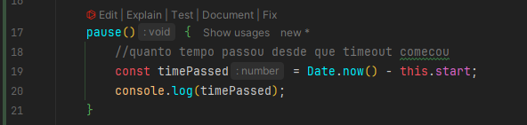

# About

Projeto da etapa 07 do curso de TypeScript da Origamid.

Iremos fazer manipulação de DOM utilizando TS para fazer um slide (tipo stories do Instagram).

## Estrutura do projeto

### HTML

### CSS

### TypeScript

Iremos trabalhar com um módulo para lidar com a div que contém tudo (o container).

Criaremos um módulo ``Slide.ts``. A pessoa que for utilizar, necessariamente precisa passar no construtor o: container,
os elementos (uma array), os controles e o tempo (que por padrão será 5000 milissegundos).

#### Slide.ts


Agora, com a classe criada e devidamente exportada, iremos utilizá-la no arquivo TS principal.

#### Main.ts

Agora, é o padrão, selecionar os elementos que criamos no HTML, verificar se eles existem e instanciar a classe.

**IMPORTANTE:** quando selecionamos a classe ``slide-elements`` que irão conter os elementos filhos a serem utilizados, ele
nos retorna uma ``HTMLCollection``. Entretanto, na nossa classe nós queremos um Array de Element.

Para resolver isso, é fácil! Basta converter utilizando ``Array.from``. E, além disso, selecionamos essa ``HTMLCollection``,
para verificar sua length, isto é, para verificar se existe ao menos um elemento ali dentro.

```ts
import Slide from "./Slide.ts";

const container = document.getElementById("slide");
const elements = document.getElementById("slide-elements");
const controls = document.getElementById("slide-controls");

if (container && elements && controls && elements.children.length) {
    new Slide(container, Array.from(elements.children), controls, 3000);
}
```

Vamos agora, começar a construir o processo de slides!

#### Show slide

Para que o slide apareça, precisamos que ele tenha a classe ``active``, correto?

Dentro da classe de ``Slide``, podemos começar criando um método ``show()``, que receberá um index (number). Ora, os slides
estão dentro de uma Array, certo? Então precisamos acessar o item em questão.

Só tem um problema. Se chegássemos no método e simplesmente adicionássemos a classe ``active``, as outras imagens
permaneceriam com a classe.

Então, faremos o seguinte:

1. Criaremos um método chamado ``hide(element: Element)``. Ele irá receber um elemento e iremos remover a sua classe ``active``;
2. Agora, dentro do método show, podemos pegar o Array de slides (que criamos no início e é o Array com os itens), 
fazer um loop por ele e utilizando o método hide no elemento em questão;
3. Após isso, podemos adicionar a classe ``active``;
4. **Um adendo: Podemos criar duas variáveis nessa classe, index e slide. Serão variáveis responsáveis por salvar qual index/slide
está ativo no momento.**

**Lembrete! Sempre que criamos uma nova propriedade/atributo, ele PRECISA ser instanciado dentro do construtor da classe.**

#### hide() & show()

```ts
    hide (element: Element) {
        element.classList.remove('active');
    }

    show(index: number) {
        //salva o item que está ativo no momento para métodos futuros
        this.index = index;

        //salva o elemento que está ativo no momento para métodos futuros
        this.slide = this.slides[this.index];

        this.slides.forEach(element => this.hide(element));

        this.slide.classList.add('active');
    }
```

⬇️ Veja as duas variáveis criadas e sendo instanciadas dentro do construtor (podendo agora, utilizar o ``this.index``) dentro
da chamada do método ``show()``.


Agora, dentro do ``Main.ts``, podemos utilizar o método ``show()``:


Vamos agora para o método responsável por controlar os slides.

#### previous and next slide

Inicialmente, iremos criar dois métodos: ``addControls()`` e ``init()``. Ambos métodos serão privates, não serão acessados
por ninguém.

O ``init()`` será responsável por criar uma configuração inicial, ele irá:

1. Iniciar o ``addControls()``;
2. E iniciar o método ``show()``, responsável por mostrar o primeiro slide, que previamente estava no construtor da nossa classe.

Já o ``addControls()`` será ativado somente uma vez (dentro do método ``init()``). Ele será responsável por:

1. Criar os botões de prev/next;
2. Adicionar os listeners (pointerup) com as suas respectivas funções.
3. A função será arrow function apontando para o método diretamente.

O pointerup basicamente é para mobile também e deixa você apertar e segurar, sem ativar até soltar.

<hr>

No tocante a estilização: Ver aula 703.

###### Lógica de cálculo (previous e next)

Vejamos agora como fazer o cálculo para o botão de next/prev.

Vamos fazer uma constante que irá possuir um cálculo ternário, verificando se o próximo slide existe. Caso ele não exista,
ele tem que retornar zero para voltar a primeira imagem.

###### Next

```ts
next() {
    const next = (this.index + 1) < this.slides.length ? this.index + 1 : 0;
    this.show(next);
}
```

###### Prev

```ts
prev() {
    const prev = (this.index - 1) > 0? this.index - 1 : this.slides.length - 1;
    this.show(prev);
}
```

#### Auto Slide

Assim que clicarmos para passar para o próximo, ele vai contar um tempo e seguir para a próxima imagem.

Inicialmente, poderíamos fazer assim:

```ts
private autoSlide(time: number) {
    const id = setTimeout(() => this.next(), time);

    clearTimeout(id);
}
```

E iniciaríamos esse método dentro do ``show()``. Mas tem um porém!

Se a gente clica numa imagem com esse ``autoSlide`` rolando, ele vai instanciar um outro timeout. Poderíamos utilizar sim
o ``clearTimeOut(id)``, entretanto nosso modelo irá possuir a lógica de: se clicarmos na tela e segurar, ele vai pausar o timeout.

Então precisamos criar uma API, um timeout customizado que irá permitir que a gente pause/continue/limpar a hora que quiser,
sem precisar puxar pelo ID. 

<hr>

Criaremos um módulo chamado Timeout, realizando o export. Será uma classe, então terá algumas propriedades, como:

1. Seu ID;
2. A função que é ativada (handler), função de callback
3. Seu construtor

O construtor será "imitando" o ``setTimeout``, veja:


Ele recebe o handler (que é do tipo TimeHandler) e o valor (tempo). Portanto, utilizaremos esse TimeHandler dentro do
construtor.

Para pegarmos o ID, basicamente é alocar dentro dele o setTimout(), utilizando o handler e time.

<hr>

Com isso feito, podemos voltar para a classe do slide e importar essa classe (não esquecer do new).

Agora, vamos a um adendo: para que possamos limpar o tempo, iremos criar um método clear dentro da nossa classe, 
que irá utilizar o ID da mesma.

Para podermos utilizar este método, precisamos alocar essa classe dentro de uma variável. Criamos lá em cima, ela precisa
ser do tipo TimeOut ou null (null é quando o timeout não foi iniciado).

Portanto, dentro do construtor, ela será instanciada como null inicialmente.

Assim, sendo que esse método auto for iniciado, antes, precisamos limpar com o ``clear()``.


##### Timeout pause

Iremos para o método responsável por pausar o timeout.

Primeiro, criaremos uma função de pause, que será ativada dentro de controls. Iremos utilizar o EventListener de ``pointerdown``.

Para checar se está pausado, podemos criar uma propriedade booleana que iniciará como false inicialmente, e dentro da 
função será true (ao ser ativada).

Para começar a funcionar, podemos, por exemplo, ir na nossa função de next e verificar. Se a propriedade ``paused``
for true, encerrar o método next.

Bom, logicamente, agora precisamos de uma função responsável por continuar o que fora pausado.

Faremos a mesma coisa, criar uma função de continue e ativá-la dessa vez com o ``pointerup``.
<hr>

E agora começa alguns "probleminhas". Exemplo: quando a gente realiza o pause e solta, ele vai imediatamente para a
função de continue.

E outra coisa, a ideia não é pausar o slide assim que a gente clicar, precisa ter alguns milissegundos para que isso
aconteça.

Então, podemos dentro da função de pause, iniciar um novo ``Timeout``! Deixando a propriedade paused como true e passando
o tempo desejado para que o slide seja pausado.

E agora surge um novo problema: nós settamos um novo Timeout, e aquele ``Timeout`` anterior? Bom, precisamos criar uma nova
propriedade que assim como o outro ``Timeout``, irá alocar a ID desse novo, para que possamos limpar ele dentro do ``continue()``.

Por fim, precisamos reiniciar o processo do ``autoSlide()`` que fora pausado anteriormente. 
<hr>

Chamada dos métodos dentro do addControls. Lembre-se, eles estão sendo adicionados na div ``slide-controls``, que possui
os botões.


<hr>

Método continue e pause! Repare:

No pause, nós instanciamos um novo ``Timeout`` para que o slide seja pausado após 300 milissegundos, e alocamos a ID
desse Timeout dentro de uma variável.

Já no continue, limpamos esse Timeout criado, e caso o paused seja true, settamos como false e iniciamos o ``autoSlide``
novamente.

```ts
pause() {
    this.pausedTimeout = new Timeout(() => {
        this.paused = true;
    }, 300)
}

continue() {
    this.pausedTimeout?.clear();

    if (this.paused) {
        this.paused = false;
        this.autoSlide(this.time);
    }
}
```

<hr>

Utilização da propriedade booleana criada dentro do método ``prev`` e ``next``. Caso seja true, a função não irá funcionar.


<hr>

A ideia agora é terminar de melhorar esse ``Timeout`` para que ele não resete o tempo do slide e sim continue de onde
parou, exatamente como nos stories da rede social.

Iremos para a classe de Slide e criaremos um método de ``pause`` e ``continue``.

<hr>

Vamos começar no pause. Qual seria a ideia? 

Primeiro, devemos capturar qual momento do dia o ``Timeout`` começou, podemos capturar isso com o ``Date.now()``,
alocado em uma nova propriedade.

E para saber quanto tempo passou desde que o timeout começou até o slide ser pausado, podemos pegar essa variável 
diminuindo para o tempo atual, usando novamente o ``Date.now()``.



Para saber quanto tempo falta para o slide acabar, criamos uma nova variável. Ela será iniciada no construtor com o tempo
do slide que foi passado.

E dentro da função de paused, iremos subtrair esse tempo com o tempo que passou. Após isso, podemos dar um clear no
``Timeout``.

Repare nas variáveis criadas e instanciadas no construtor, sendo utilizadas dentro do método.


<hr>

Já no continue, também é bem simples. Podemos iniciar o método dando um clear.

Após isso, settamos um novo ``Timeout``, passando o handler, mas dessa vez com o **tempo restante para o slide acabar.**

Finalizamos passando um novo tempo de start, com a data sendo >agora<.


<hr>

E utilizamos ambos os métodos dentro de ``continue()`` e ``pause()`` em ``Slide.ts``.

Acessando os métodos na classe ``Timeout``:


<hr>

#### VideoElement

Iremos trabalhar por fim agora com o vídeo. A ideia é que o video tenha o tempo de duração dele, não do tempo que passamos
no Timeout.

<hr>

Na função responsável por mostrar os slides, iremos fazer uma verificação. Caso o item seja HTMLVideoElement, irá
ativar uma função específica. Se não, irá utilizar a ``autoSlide`` normalmente.

```ts
show(index: number) {
    //salva o item que está ativo no momento para métodos futuros
    this.index = index;

    //salva o elemento que está ativo no momento para métodos futuros
    this.slide = this.slides[this.index];

    this.slides.forEach(element => this.hide(element));

    this.slide.classList.add('active');

    //define o tempo do slide
    if (this.slide instanceof HTMLVideoElement) {
        this.autoVideo(this.slide);
    } else {
        this.autoSlide(this.time);
    }
}
```

<hr>

No tocante ao método em sí, iniciaremos mutando o video e dando o play. A duração (que iremos passar no ``autoSlide``),
é só acessar a propriedade e multiplicar por 1000, pois a duração vem por padrão sem segundos.

```ts
autoVideo(video: HTMLVideoElement) {
    video.muted = true;
    video.play();

    const duration = video.duration * 1000;

    this.autoSlide(duration);
}
```

Para que o vídeo resete caso a gente avance/volte o slide, precisamos mudar sua propriedades quando ele perde a classe
``active``:

```ts
hide (element: Element) {
    element.classList.remove('active');

    if (element instanceof HTMLVideoElement) {
        //bota o video no inicio
        element.currentTime = 0;
        element.pause();
    }
}
```

<hr>

Por fim, para que a gente consiga pausar o video ao apertar no slide, é só fazer uma verificação nos métodos de ``pause``
e ``continue``:

```ts
pause() {
    this.pausedTimeout = new Timeout(() => {
        this.paused = true;

        this.timeout?.pause();

        if (this.slide instanceof HTMLVideoElement) {
            this.slide.pause();
        }
    }, 300);
}

continue() {
    this.pausedTimeout?.clear();

    if (this.paused) {
        this.paused = false;

        this.timeout?.continue();

        if (this.slide instanceof HTMLVideoElement) {
            this.slide.play();
        }
    }
}
```

<hr>

Podemos também, fazer essa verificação para ter certeza de que o video foi carregado.

É bom fazer ela porque caso o vídeo não tenha sido carregado, ao fazer a conta da duração multiplicando por 1000, caso
o video não exista irá quebrar a aplicação.

Criamos um eventListener para 'playing', e fazemos a conta/ativamos a função. Além disso, criamos uma ``let`` do tipo
boolean true, para fazer essa verificação somente uma vez.

Então assim que entramos no eventListener e no if, já settamos ela para false.

```ts
autoVideo(video: HTMLVideoElement) {
    video.muted = true;
    video.play();

    let firstPlay = true;

    video.addEventListener('playing', () => {
        if (firstPlay) {
            firstPlay = false;
            const duration = video.duration * 1000;
            this.autoSlide(duration);
        }
    })
}
```